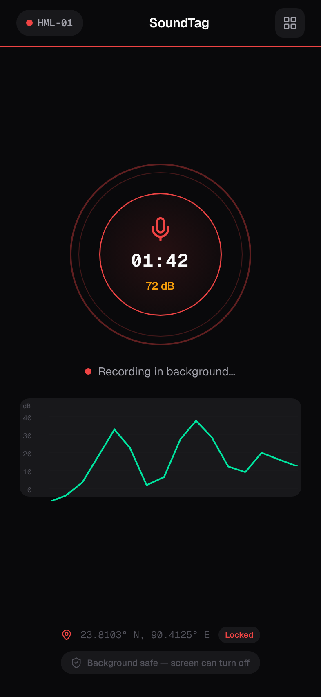
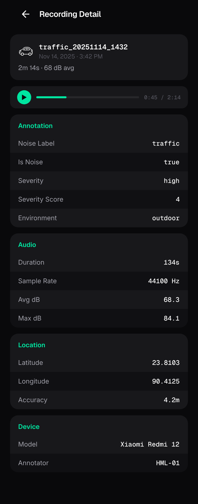

# SoundTag

**Urban Noise Dataset Collector for Machine Learning**

SoundTag is an Android app for collecting and annotating urban noise audio data. Built for field research teams studying noise pollution in cities like Dhaka, it records audio with GPS metadata, lets users annotate noise type and severity, and syncs everything to Google Drive.

## Screenshots

<p align="center">
  
  
  
  
</p>
<p align="center">
  
  
  
  
</p>

## Features

### Recording
- One-tap record/stop with background recording support
- Live MM:SS timer with foreground notification
- Wake lock prevents phone sleep during recording
- Min 5s / max 5min duration guards
- AAC audio at 44100Hz mono (.m4a)
- Live decibel meter with color indicator (green/yellow/red)

### Metadata Capture (Automatic)
- GPS coordinates + accuracy at recording start
- Timestamp (local timezone)
- Duration, device model, OS version, app version
- Annotator ID (set once in settings)
- Decibel levels: avg, max, min dB from amplitude sampling

### Annotation (Post-Recording)
- Noise type: Traffic, Horn, Construction, Industrial, Crowd, Nature, Silence, Mixed
- Severity: Low / Medium / High + 1-5 numeric score
- Is Noise toggle (yes/no)
- Environment: Indoor / Outdoor
- Location context: Roadside, Market, Residential, Construction Site, Industrial Zone, Other
- Custom filename with auto-suggestion
- Free-text notes
- Audio playback to review before saving

### Save & Sync
- Saves .m4a audio to `Music/SoundTag/`
- Saves .json metadata sidecar to `Documents/SoundTag/`
- Google Drive upload via OAuth (optional)
- Custom shared folder selection with subfolder browsing
- Offline queue with auto-retry via WorkManager
- Upload status tracking (Uploaded / Pending / Failed)

### Dashboard
- Recording history with upload status badges
- Dataset stats: count per noise label with bar chart
- Balance warnings for underrepresented classes
- Recording locations with Google Maps links
- Retry failed uploads, delete recordings
- Audio playback from history
- Tap recording → full detail screen with JSON metadata table

## JSON Output Schema

Every recording produces an `.m4a` audio file and a `.json` sidecar:

```json
{
  "input_features": {
    "geospatial": {
      "latitude": 23.810332,
      "longitude": 90.412521
    },
    "temporal": {
      "year": 2025, "month": 11, "date": 14,
      "day": 4, "hour": 14, "min": 32, "sec": 10
    }
  },
  "classification": {
    "target": "noise_label",
    "categories": ["traffic", "horn", "construction", "industrial", "crowd", "nature", "silence", "mixed"]
  },
  "annotation": {
    "noise_label": "traffic",
    "is_noise": true,
    "severity": "high",
    "severity_score": 4,
    "environment": "outdoor",
    "location_context": "roadside"
  },
  "recording": {
    "filename": "traffic_20251114_1432.m4a",
    "duration_seconds": 134,
    "sample_rate_hz": 44100,
    "channels": 1,
    "encoding": "AAC",
    "avg_db": 68.3,
    "max_db": 84.1,
    "min_db": 42.7,
    "db_samples": 134
  },
  "device": {
    "model": "Xiaomi Redmi Note 12",
    "android_version": "13",
    "app_version": "1.0.0",
    "annotator_id": "HML-01"
  }
}
```

## Tech Stack

- **Language:** Kotlin
- **UI:** Jetpack Compose, Material 3
- **Architecture:** ViewModel + StateFlow, Coroutines
- **Audio:** MediaRecorder (AAC/MPEG4, 44100Hz mono)
- **Location:** FusedLocationProviderClient (play-services-location)
- **Storage:** MediaStore API
- **Upload:** Google Drive API v3 + Google Sign-In
- **Background:** LifecycleService, WorkManager
- **Min SDK:** 30 (Android 11)

## Setup

### Prerequisites
- Android Studio Ladybug or newer
- Android device/emulator running API 30+

### Build
```bash
git clone https://github.com/your-username/SoundTag.git
cd SoundTag
./gradlew assembleDebug
```

### Google Drive Setup (Optional)
1. Create a project at [Google Cloud Console](https://console.cloud.google.com)
2. Enable the **Google Drive API**
3. Configure **OAuth consent screen** (External, add test users)
4. Create **OAuth Client ID** (Android, package `com.soundtag`, your debug SHA-1)
5. Add team members as test users in OAuth consent screen

Get your debug SHA-1:
```bash
keytool -list -v -keystore ~/.android/debug.keystore -alias androiddebugkey -storepass android 2>/dev/null | grep SHA1
```

### Team Usage
1. Admin creates a shared Google Drive folder, shares with team as Editor
2. Each member installs the app, enters name + annotator ID
3. Connects to Google Drive, selects the shared folder
4. Start collecting! Recordings sync automatically.

## Project Structure

```
com.soundtag/
├── SoundTagApp.kt                 # Application class, notification channel
├── MainActivity.kt                # Navigation, permissions, screen wiring
├── data/
│   ├── LocationHelper.kt          # GPS fetch with 5s timeout
│   ├── AnnotationData.kt          # Annotation form data class
│   ├── MetadataWriter.kt          # JSON sidecar builder
│   ├── FileSaver.kt               # MediaStore save logic
│   ├── DriveUploader.kt           # Google Drive upload + folder management
│   ├── UploadQueueManager.kt      # Offline upload queue
│   ├── RecordingRepository.kt     # Recording history (SharedPreferences)
│   ├── UserPreferences.kt         # User settings persistence
│   └── AudioPlayer.kt             # MediaPlayer wrapper for playback
├── service/
│   ├── RecordingService.kt        # Foreground recording service
│   └── UploadWorker.kt            # WorkManager upload retry
├── viewmodel/
│   └── RecordingViewModel.kt      # UI state management
└── ui/
    ├── theme/                     # Dark theme, colors, typography
    ├── components/                # SoundTagChip, ToggleGroup, TextField, PlaybackBar
    ├── setup/                     # Setup screen, Folder picker
    ├── record/                    # Record screen (idle + recording states)
    ├── annotate/                  # Full-screen annotation
    └── dashboard/                 # Dashboard, recording rows, dataset stats
```

## License

This project is licensed under the MIT License - see the [LICENSE](LICENSE) file for details.
